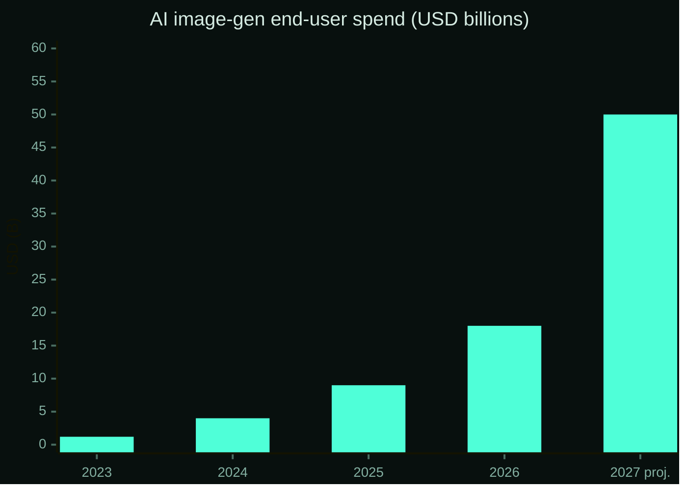

# 1. Introduction: Where Does the Value Go?

## 1.0 Market Opportunity

The AI generative content market is in the middle of a once-in-a-decade reordering.

| Metric | 2023 | 2026 | 2027 (proj.) |
|---|---|---|---|
| AI image-gen end-user spend (global) | ~$1.2B | ~$18B | **~$50B+** |
| Cost per high-quality image generation | $0.10 | $0.003 | <$0.001 |
| Independent AI consumer apps (Web/mobile) | ~30 | 800+ | 2,500+ |
| Weekly active AI image creators | ~5M | ~120M | **300M+** |

> *Sources: industry analyst projections (a16z 2025 State of Generative AI, Sequoia AI Index, Statista). Numbers indicative of order-of-magnitude trajectory rather than precise forecast.*

The technology has democratized; the economics has not. Users today create billions of dollars of generative work each year on platforms whose value capture model — flat subscriptions to centralized AI gateways — was designed in 2023 and has not evolved since. The surplus produced by user creativity flows into a small set of corporate balance sheets and accrues to no one else.

Aivive's thesis: **the next generation of AI consumer products will look less like Photoshop subscriptions and more like decentralized creative economies**, where the act of creation is itself the asset issuance event for the network underwriting it.

## 1.1 The AI Consumer Paradox

In 2026, AI image generation costs have dropped by two orders of magnitude in eighteen months. The model layer has commoditized. The marginal cost of producing a high-quality image has collapsed from dollars to fractions of a cent.

And yet, on the consumer side, the dominant business model remains unchanged from 2023: the user pays a monthly subscription to a centralized platform; the platform extracts the entire surplus; the value generated by the user's creativity accrues to the platform's balance sheet, opaque and unchallenged.

This is the paradox at the heart of consumer AI in 2026. The technology has democratized, but the economics has not.

## 1.2 Three Failed Patterns

Three patterns have attempted to bridge this gap, each falling short:

### Subscription SaaS

The default. Predictable revenue for the platform, no value capture for the user, no transparency about where the surplus goes. This is the Netflix-model of AI — durable, but boring, and vulnerable to a more aligned challenger.

### Token-as-fee

Make the user pay in the platform's native token. Theoretically aligns incentives. In practice, it adds onboarding friction, forces every user to think about price action, and frequently results in tokens whose only utility is "discount on subscription" — economically indistinguishable from a coupon.

### Token-as-governance

The most common Web3 default. Issue a token, promise governance rights, and hope the market values control over a small consumer app. Most of these tokens trade based on speculation rather than fundamentals because governance, in the absence of meaningful sink mechanisms, is not a price floor.

None of these answer the actual question:

> *If my creative use of an AI tool is producing real economic value, where is that value being measured, and where is it going?*

## 1.3 The Aivive Question

Aivive proposes a fourth pattern.

> **What if the way you fund an AI product was the same as the way you make its asset rarer?**

What if a programmable share of every dollar of revenue the platform earns was, by design and not by promise, routed into a permanent reduction of token supply? What if the loop ran automatically, on a public schedule, with every step verifiable on-chain? What if the user never had to hold or stake the token to participate, but every act of creation nonetheless contributed to the asset's scarcity?

This is not a thought experiment. It is the operating model of *Aivive* — and the first instance of a new category we call a **Recursive AI Protocol (RAP)**: an on-chain economic system where each act of consuming the AI product *recursively* tightens the supply of the protocol's underlying asset.

The recursion is what makes it work. Use generates revenue. Revenue compresses supply. Compressed supply increases per-token value. Higher value attracts more use. Each turn of the loop reinforces the next, with no human in the path.

---

[← Cover](README.md) · [Vision →](02-vision.md)
