# 3. The Aivive Network

## 3.1 Network as Economic Primitive

Aivive is not a Layer-1 blockchain. It is not a sidechain. It is, more precisely, an **economic primitive** that lives across two production-grade chains — Solana and Base — and is operated by an automated pipeline of audited smart contracts and serverless cron jobs.

The choice not to build a new chain is deliberate. The cost of operating a credible new L1 in 2026 is high; the value of doing so for a single consumer application is low. By living on top of Solana (for token issuance and DEX liquidity) and Base (for stablecoin payment and consumer-app UX), Aivive inherits the security, liquidity, and infrastructure of two of the most active ecosystems in the industry.

## 3.2 Cross-Chain Architecture

The Aivive network spans:

- **Solana mainnet** — home of the *AVV* SPL token, where all destruction events occur and where decentralized exchange liquidity is concentrated.
- **Base mainnet** — home of platform revenue collection, where users pay in USDC for AI generation and where the platform's primary treasury Safe multisig resides.

The two chains are connected by **Circle's Cross-Chain Transfer Protocol (CCTP)**, an officially audited burn-and-mint primitive native to USDC. This is not a third-party bridge in the traditional sense. There are no custodial pools. USDC is destroyed on the source chain and minted on the destination chain through Circle's attestation network.

## 3.3 The Buyback-and-Burn Cycle

```mermaid
flowchart LR
    U([User]) -->|USDC payment| BT[Base Treasury<br/>Safe 2-of-3]
    BT -->|Daily check| TH{Balance<br/>≥ $1k?}
    TH -->|No| BT
    TH -->|Yes| BURN[CCTP burn<br/>USDC on Base]
    BURN -->|Wormhole<br/>attestation ~15min| MINT[CCTP mint<br/>USDC on Solana]
    MINT --> ST[Solana Treasury<br/>Squads 2-of-3]
    ST -->|Jupiter swap| SWAP[USDC → AVV<br/>1% slippage cap]
    SWAP -->|SPL Token Burn| FIRE[(AVV<br/>Permanently<br/>Destroyed)]
    FIRE -.->|Tx verifiable on| SOL[Solscan]
    FIRE -.->|Aggregated on| DUNE[Dune dashboard]
    
    classDef user fill:#FF8A5C,stroke:#C9572E,color:#08100E
    classDef treasury fill:#0B7A63,stroke:#4FFFD8,color:#ECF7F2
    classDef bridge fill:#1F3D34,stroke:#84B0A2,color:#ECF7F2
    classDef burn fill:#08584A,stroke:#4FFFD8,color:#A8FFEB
    classDef public fill:#16302A,stroke:#84B0A2,color:#D5EBE2
    
    class U user
    class BT,ST treasury
    class BURN,MINT,SWAP bridge
    class FIRE burn
    class SOL,DUNE public
```

Every week, the following cycle executes automatically:

1. The Base treasury's accumulated USDC balance is checked against a configured threshold.
2. If above threshold, the Safe multisig (2-of-3) signs a CCTP burn instruction. USDC is destroyed on Base.
3. Circle's attestation network produces proof of the burn (~15 minutes).
4. The Solana side of the loop calls into the Squads multisig (2-of-3), which mints equivalent USDC into the Solana treasury.
5. The Solana treasury then routes the USDC through Jupiter, the leading aggregator on Solana, swapping it for *AVV* at the best available rate.
6. The acquired *AVV* is burned via the standard SPL Token Burn instruction. The supply of *AVV* is reduced. The transaction is publicly verifiable on Solscan.

Every step in this loop is observable. There is no place in the pipeline where discretion can override the schedule. The only point of human intervention is the multisig signing, which itself follows pre-published thresholds and rules.

## 3.4 What This Looks Like in Practice

Within the first 60 days of mainnet operation, the network will execute its first revenue-driven burn cycle ($100 USDC pilot). By the end of the V1 launch window, weekly burn cycles will be operational. A public dashboard at `aivive.ai/burn` and a Dune Analytics page at `dune.com/aivive` will surface every burn transaction with a Solscan link, alongside aggregate metrics: cumulative *AVV* destroyed, USDC inflow, average burn-per-week, and effective deflationary rate.

This is what a verifiable AI consumer economy looks like in motion.

---

[← Vision](02-vision.md) · [aivive.ai →](04-product.md)
