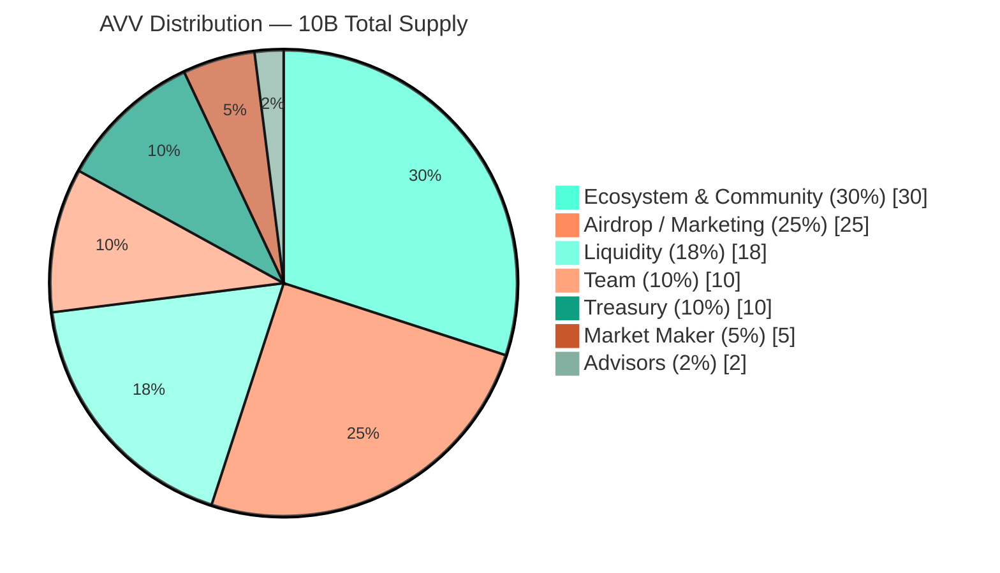

# 6. Tokenomics

## 6.1 Token Specification

| Field | Value |
|---|---|
| **Name** | Aivive |
| **Ticker** | AVV |
| **Network** | Solana (SPL Token) |
| **Total Supply** | 10,000,000,000 AVV |
| **Initial Circulating** | ~1,000,000,000 AVV (10%) |
| **TGE FDV Target** | $20–30M USDT |
| **Initial Price** | $0.002–0.003 USDT |
| **Decimals** | 9 (SPL standard) |
| **Mintability** | Not mintable post-deployment |
| **Pausability** | Not pausable |
| **Transfer Tax** | None |
| **Authority** | Squads 2-of-3 multisig |
| **Audit** | CertiK |

## 6.2 Distribution



| Allocation | % | Amount (AVV) | Purpose |
|---|---|---|---|
| Team | 10% | 1,000,000,000 | Core contributors, vesting 2-month cliff + 10-month linear |
| Liquidity | 18% | 1,800,000,000 | Exchange and DEX liquidity provisioning |
| Market Maker | 5% | 500,000,000 | Operational liquidity for centralized exchange listings |
| Ecosystem & Community Incentives | 30% | 3,000,000,000 | Creator rewards, partnership campaigns, community programs |
| Airdrop / Marketing | 25% | 2,500,000,000 | Launch airdrop and ongoing distribution campaigns |
| Treasury / DAO Reserve | 10% | 1,000,000,000 | Long-term operations, vesting 2-month cliff + 10-month linear |
| Advisors | 2% | 200,000,000 | Strategic advisors, vesting 4-month cliff + 8-month linear |
| **Total** | **100%** | **10,000,000,000** | |

## 6.3 Distribution Notes

The structure intentionally over-weights community-facing allocations: **Ecosystem (30%) plus Airdrop (25%) account for 55% of total supply.** This reflects the project's core thesis that the value of the network is determined by the creative communities that use it, not by the discretionary control of a small holder set.

The team allocation of **10%** is meaningfully below industry median, reflecting both the small size of the founding team and the project's commitment to alignment with public token holders.

## 6.4 No Private Round, No IDO

Aivive has not conducted, and does not intend to conduct, a private investor round, seed sale, or initial DEX offering at TGE. The full circulating supply at launch derives from Liquidity, Airdrop, and operational allocations. **There are no early-investor unlock cliffs that could create overhang at listing.**

This is a deliberate choice. Tokens with concentrated private allocations face structural sell pressure that harms public market participants. Aivive's architecture is community-first by capital structure, not just by marketing.

## 6.5 Valuation Mathematics

The TGE parameters can be summarized in three formulas:

```
FDV (Fully Diluted Valuation) = Total_Supply × Initial_Price
                              = 10,000,000,000 × $0.0025  (mid-point)
                              = $25,000,000

Initial Market Cap            = Initial_Circulating × Initial_Price
                              = 1,000,000,000 × $0.0025
                              = $2,500,000

Circulating Ratio (TGE)       = Initial_Circulating / Total_Supply
                              = 10%
```

The 10% circulating-at-TGE ratio is intentionally conservative for an AI-consumer category launch. Combined with the absence of private investors, this minimizes overhang risk and maximizes the impact of any post-launch deflationary mechanism on float.

## 6.6 Vesting Visualization

Cumulative unlock schedule for the locked allocations (Team / Treasury / Advisors), in months from TGE:

```
Month        0    2    4    6    8   10   12   14
              |    |    |    |    |    |    |    |
Team (10%)    █────────●●●●●●●●●●●●●●●●●●●●●●●●○      cliff 2 + linear 10
Treasury(10%) █────────●●●●●●●●●●●●●●●●●●●●●●●●○      cliff 2 + linear 10
Advisors(2%)  █────────────────●●●●●●●●●●●●●●●●○      cliff 4 + linear 8

Liquidity / MM / Ecosystem / Airdrop allocations are unlocked at TGE
or governed by separate operational schedules — they do NOT contribute
to time-based unlock supply pressure.
```

The locked supply (Team + Treasury + Advisors = **22%** of total) follows long, smooth schedules that align core stakeholders with multi-year network growth rather than short-term price discovery.

---

[← Architecture](05-architecture.md) · [Token Utility →](07-token-utility.md)
