# 7. Token Utility & The Economic Loop

## 7.1 Utility Statement

**AVV is the deflationary anchor of the Aivive consumer economy.**

It is **not** a payment token used by end users to fund individual generations. It is **not** a staking token gating product access. It is **not** a governance token in the V1 timeframe.

Its sole V1 utility — and, the project argues, its most credible utility — is that it is **permanently destroyed at a rate proportional to the platform's revenue**. Every dollar spent on aivive.ai produces, in expectation, a measurable, irreversible reduction in *AVV* supply.

## 7.2 The Three-Segment Loop

```mermaid
sequenceDiagram
    autonumber
    participant U as User<br/>(Privy wallet)
    participant BT as Base Treasury<br/>(Safe 2/3)
    participant CCTP as Circle CCTP
    participant ST as Solana Treasury<br/>(Squads 2/3)
    participant J as Jupiter
    participant AVV as AVV (SPL)
    
    rect rgb(11, 122, 99)
        Note over U,BT: Segment 1 — User Payment (real-time, on Base)
        U->>BT: USDC.transfer(amount)
        BT-->>U: Credits issued (BaseScan tx visible)
    end
    
    rect rgb(31, 61, 52)
        Note over BT,ST: Segment 2 — Cross-Chain Aggregation (weekly)
        BT->>CCTP: depositForBurn(USDC, dest=Solana)
        CCTP-->>CCTP: Attestation proof (~15min)
        CCTP->>ST: Mint equivalent USDC on Solana
    end
    
    rect rgb(8, 88, 74)
        Note over ST,AVV: Segment 3 — Buyback & Burn (Solana, automatic)
        ST->>J: Swap USDC → AVV (1% slippage)
        J-->>ST: AVV acquired
        ST->>AVV: SPL Token Burn instruction
        AVV-->>ST: Supply reduced (Solscan tx)
    end
```



The economic loop runs in three segments, each independently observable.

### Segment 1: User Payment (real-time)

A user purchases generation credits at `aivive.ai/me/wallet`. The platform generates a USDC transfer intent on Base mainnet. The user signs the transfer through their Privy embedded wallet. The transaction settles on Base, an Alchemy webhook fires, and the user's credit ledger balance updates within seconds.

**The user can verify their payment on BaseScan.**

### Segment 2: Cross-Chain Aggregation (daily/weekly)

An Inngest scheduled job inspects the Base treasury balance daily. When the threshold is met (target: **$1,000+ accumulated USDC**), the Safe multisig signs a CCTP burn transaction. USDC is destroyed on Base. After approximately 15 minutes, Circle's attestation produces a verifiable proof, which the Solana side uses to mint equivalent USDC into the Squads-controlled treasury.

Every step is recorded in the platform's `cross_chain_transfers` table and is publicly verifiable.

### Segment 3: Buyback & Burn (Solana, automatic)

Once USDC arrives on Solana, an Inngest job triggers the Squads multisig to authorize a swap through Jupiter aggregator. The acquired *AVV* is then immediately burned via the standard SPL Token Burn instruction.

**The transaction signature is recorded in the platform's `burn_runs` table and is verifiable on Solscan.**

## 7.3 Why This Design

The three-segment structure deliberately separates user-facing payment (Base, low gas, fast UX) from monetary mechanism (Solana, established AVV liquidity, low burn fees).

- The **user** never has to think about the second and third segments.
- The **platform** never has to compromise UX for the sake of "putting everything on one chain."

This design also avoids the most common failure mode of token-utility designs: **requiring users to hold the token to access the product**. By making *AVV* a deflationary anchor rather than a payment medium, Aivive sidesteps the onboarding friction that has plagued previous attempts at AI-and-token integration.

## 7.4 Comparable Patterns

The buy-back-and-burn pattern is well-established in token design. Notable precedents include:

| Project | Mechanism |
|---|---|
| **BNB** (Binance) | Quarterly burn from exchange revenue — the original deflationary template at scale |
| **GMX** (decentralized perpetuals) | Protocol fees converted to native token destruction |
| **SNX** (synthetic asset issuance) | Debt-pool fees driving token sink dynamics |
| **JUP** (Jupiter) | Fee structures and liquidity-driven token mechanics on Solana |

Aivive applies this established pattern to a previously underexplored category — **AI consumer applications** — and is, to the project's knowledge, the first AI-native consumer product to ship a fully automated, fully on-chain version of the model.

## 7.5 The Deflation Equation

The core supply trajectory of *AVV* can be expressed as:

```
S(t)  =  S₀  -  ∫₀ᵗ  Burn(τ) dτ

where:
  S(t)     = circulating supply of AVV at time t
  S₀       = initial total supply  =  10,000,000,000 AVV
  Burn(τ)  = AVV destroyed per unit time at time τ
```

For any given burn cycle (week `w`), the destroyed amount is:

```
Burn(w)  =  Revenue_USDC(w)  ×  (1 / Price_AVV(w))  ×  (1 - slippage)

where:
  Revenue_USDC(w)  = platform USDC revenue accumulated in week w
  Price_AVV(w)     = market price of AVV at swap execution
  slippage         = Jupiter swap slippage (capped at 1%)
```

### Worked Scenario

Modeled at three steady-state revenue levels (illustrative — for sizing intuition, not forecast):

| Weekly USDC Revenue | AVV Price | Weekly Burn | Annualized Burn | % of Total Supply / yr |
|---|---|---|---|---|
| $1,000 | $0.0025 | 400,000 AVV | 20.8M AVV | 0.21% |
| $10,000 | $0.005 | 2,000,000 AVV | 104M AVV | 1.04% |
| $50,000 | $0.01 | 5,000,000 AVV | 260M AVV | 2.60% |
| $200,000 | $0.02 | 10,000,000 AVV | 520M AVV | **5.20%** |

The asymmetry is the key property: as the platform's commercial success grows, *AVV* price typically grows in tandem (because of the buyback pressure itself), but **deflation rate also grows** because revenue scales faster than per-token cost. The model is **self-reinforcing**, not self-limiting.

### The Burn Cron, in Pseudocode

```typescript
// inngest/functions/swap-and-burn-cron.ts
export const swapAndBurnCron = inngest.createFunction(
  { id: "swap-and-burn", concurrency: 1 },
  { cron: "0 0 * * 1" },  // every Monday 00:00 UTC
  async ({ step }) => {
    const usdcOnSolana = await step.run("read-balance", () =>
      getSolanaTreasuryUSDCBalance()
    );

    if (usdcOnSolana < MIN_BURN_THRESHOLD_USDC) {
      return { skipped: "below threshold" };
    }

    const quote = await step.run("jupiter-quote", () =>
      jupiter.quote({ input: USDC, output: AVV, amount: usdcOnSolana, slippageBps: 100 })
    );

    if (quote.priceImpact > MAX_ACCEPTABLE_IMPACT) {
      await alertOps("burn aborted: price impact too high");
      return { skipped: "high impact" };
    }

    const swapTx = await step.run("execute-swap", () =>
      squadsExecute(jupiter.buildSwap(quote))
    );

    const avvAcquired = await step.run("verify-receipt", () =>
      readAvvBalance(SOLANA_TREASURY)
    );

    const burnTx = await step.run("burn-spl", () =>
      squadsExecute(buildSPLBurn({ mint: AVV_MINT, amount: avvAcquired }))
    );

    await step.run("record", () => db.insert(burnRuns).values({
      usdcIn: usdcOnSolana,
      avvSwapped: avvAcquired,
      swapTx,
      burnTx,
      avvPriceAtSwap: quote.outAmount / quote.inAmount,
      status: "burned",
      completedAt: new Date(),
    }));

    await broadcastBurnEvent({ avvAcquired, burnTx });
  }
);
```

Every step is checkpointed by Inngest. Failure at any step pauses the cycle until human intervention; nothing is destroyed prematurely.

## 7.6 Forward Utility (V1.5 and Beyond)

The roadmap describes a phased expansion of utility:

- **V1.5 (60–90 days post-launch)**: Tipping and content boosting. Users acquire small amounts of *AVV* to reward creators on the feed or to elevate their own work to higher visibility.
- **V2 (90–180 days)**: Creator revenue share and stake-to-earn priority generation.
- **V2+ (180+ days)**: NFT marketplace for cloned voices and style models; on-chain governance of ecosystem allocations.

These extensions will be introduced **only after V1's deflationary loop is operating at scale** and producing observable, replicable outcomes. The token's value accrual story should not depend on speculative future utility — it should be intelligible at every stage from V1 onward.

---

[← Tokenomics](06-tokenomics.md) · [Roadmap →](08-roadmap.md)
